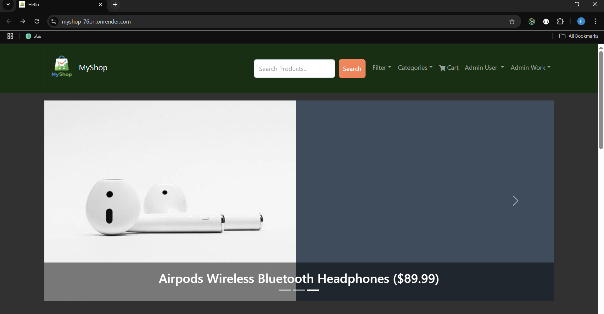
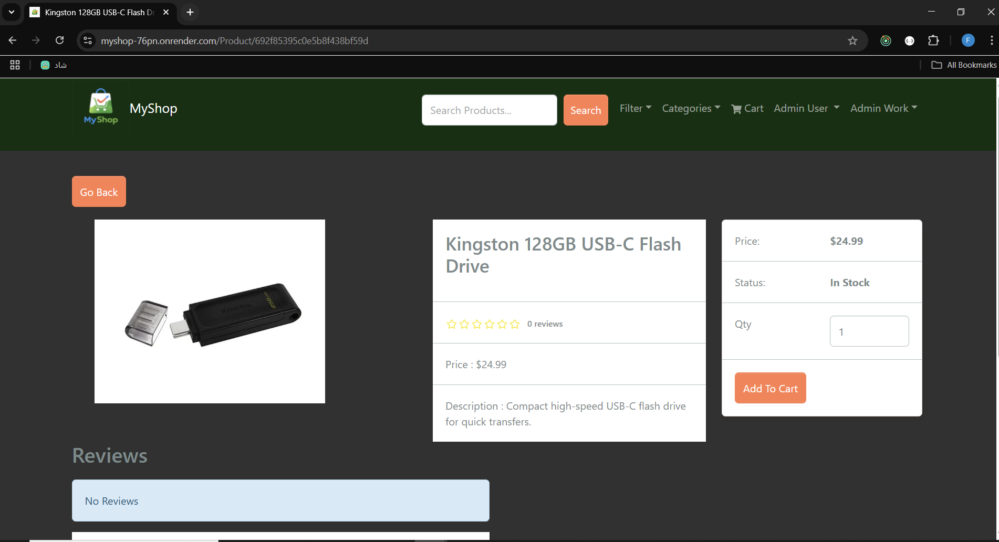
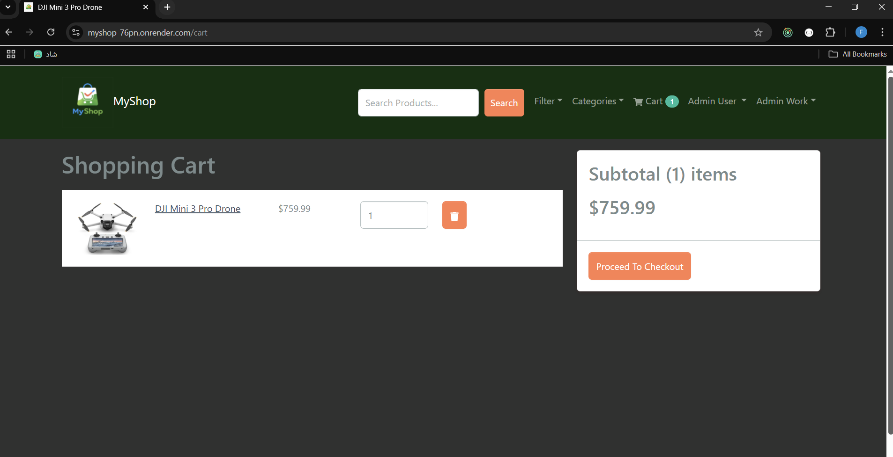
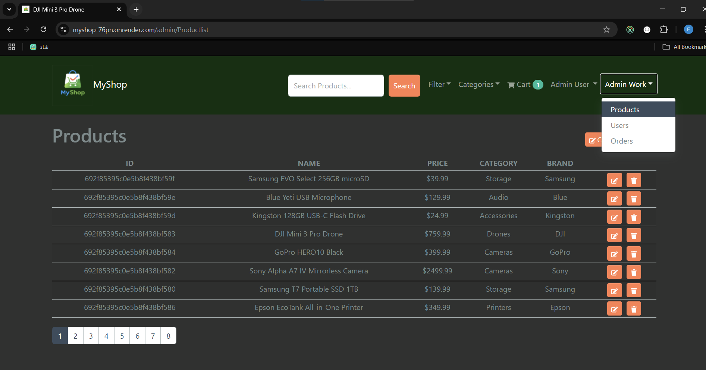
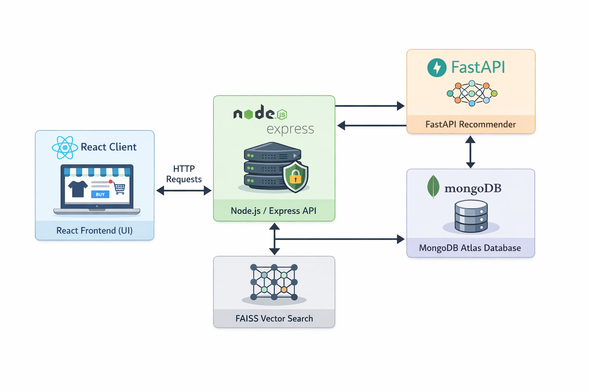
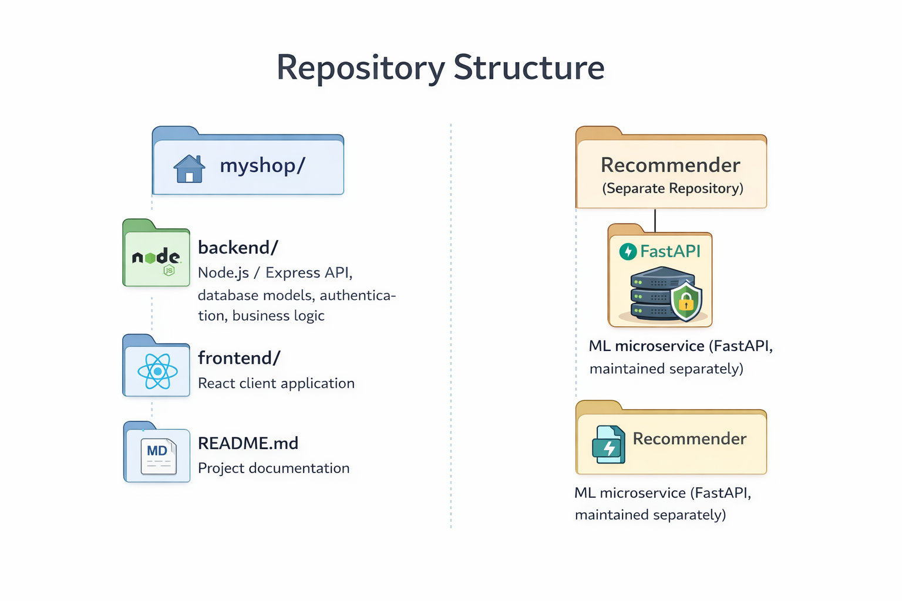

# MyShop 🛒

A full-stack **MERN e-commerce platform** with an **ML-powered hybrid recommender system** (content-based + image-based).  
Designed as a **portfolio-ready, production-aware project** with a focus on clean architecture, scalability, and real-world deployment.

🔗 **Live Demo**: https://myshop-76pn.onrender.com/

### ⚠️ Note: This project is a demo and does not have real users or live transactions.


---

## 🖼️ Screenshots







---

## ✨ Key Features

### 🧩 Core E-Commerce
- Product CRUD with image uploads
- Category, brand, price, and rating filters
- Shopping cart and checkout flow
- Secure authentication (JWT + Refresh Token)
- PayPal Sandbox integration with webhook verification
- Admin dashboard
- Responsive UI (React Bootstrap + Redux Toolkit)
- MongoDB Atlas integration

### 🤖 Hybrid Recommendation System
- Content-based embeddings (title, brand, category, metadata)
- Image-based embeddings (visual similarity)
- FAISS vector indexing for fast similarity search
- Independent ML microservice built with FastAPI
- Static embedding index (architecture supports dynamic updates)

---

### 🧠 System Architecture



###  ⚠️The recommender currently uses a static index, but the architecture supports dynamic updates on product lifecycle events (create/update/delete)

---
### 🔬 Research Perspective & Engineering Contributions

This project serves as a practical case study in building and deploying a real-world AI-integrated system. It was designed to explore specific engineering and research challenges:

· Solving the Integration Problem: The microservice architecture provides a clear solution for seamlessly integrating a Python-based ML model (CLIP + SBERT embeddings) into a JavaScript-based production web application, addressing a common industry hurdle.

· Hybrid Recommender as a Research Prototype: The system implements a working prototype of a hybrid recommender that combines content-based (text) and image-based similarity. This serves as a testbed for future research into weighting mechanisms, multimodal fusion, and personalization.

· Trade-off Analysis in Practice: The choice of FAISS for approximate search explicitly tackles the real-world trade-off between recommendation accuracy and system latency, demonstrating informed decision-making for production environments.

· Foundation for Future Research: The current static embedding pipeline is architecturally prepared for evolution into a dynamic, event-driven system. This opens clear research directions in real-time embedding updates, model freshness, and A/B testing frameworks.

---
### 🛠️ Tech Stack
### Frontend

React

Redux Toolkit

Axios

React Bootstrap

### Backend

Node.js

Express.js

MongoDB with Mongoose

JWT + Refresh Token authentication

PayPal Sandbox integration

### Machine Learning Service

FastAPI

NumPy

FAISS (CPU)

Sentence Transformers (text embeddings)

CLIP (image embeddings via Torch / Torchvision)

### Deployment & Infrastructure

Render (Free Tier)

MongoDB Atlas

Cloudinary (image storage)

---
### 📦 Repository Structure




### ⚠️ The recommender service is maintained in a separate repository and can be deployed independently.

---
### 🚀 Getting Started (Local Development)
### Backend
```bash

cd backend
npm install
npm run dev
```

### Frontend
```bash
cd frontend
npm install
npm start
```

### ML Service (Optional)
```bash
git clone https://github.com/FatimaAhmadinejad/Recommender
cd Recommender
pip install -r requirements.txt
python build_embeddings.py
uvicorn api:app --reload
```


"The main application works independently of a local ML service. Recommendations are served from the deployed ML service on Render."
---
### 🔮 Future Improvements

Fully dynamic embedding updates using event-driven pipelines

Real-time recommendations for newly added products

Advanced hybrid ranking based on user interaction signals

Model optimization and reduced inference latency

User notification system (Email / SMS)

---
### 🎯 Project Motivation

This project was built as a portfolio-ready, real-world system to demonstrate:

Practical full-stack architecture decisions

Clean separation between application logic and machine learning logic

Scalable backend and microservice design

Production-aware deployment considerations

---
📄 **Full Project Documentation (DOCX)**: [Download](./Document.docx)

---

### 👩‍💻 Author

Fatima Ahmadinejad
Computer Engineering – Software Engineering

---
### 📄 License

For educational and portfolio purposes only.
